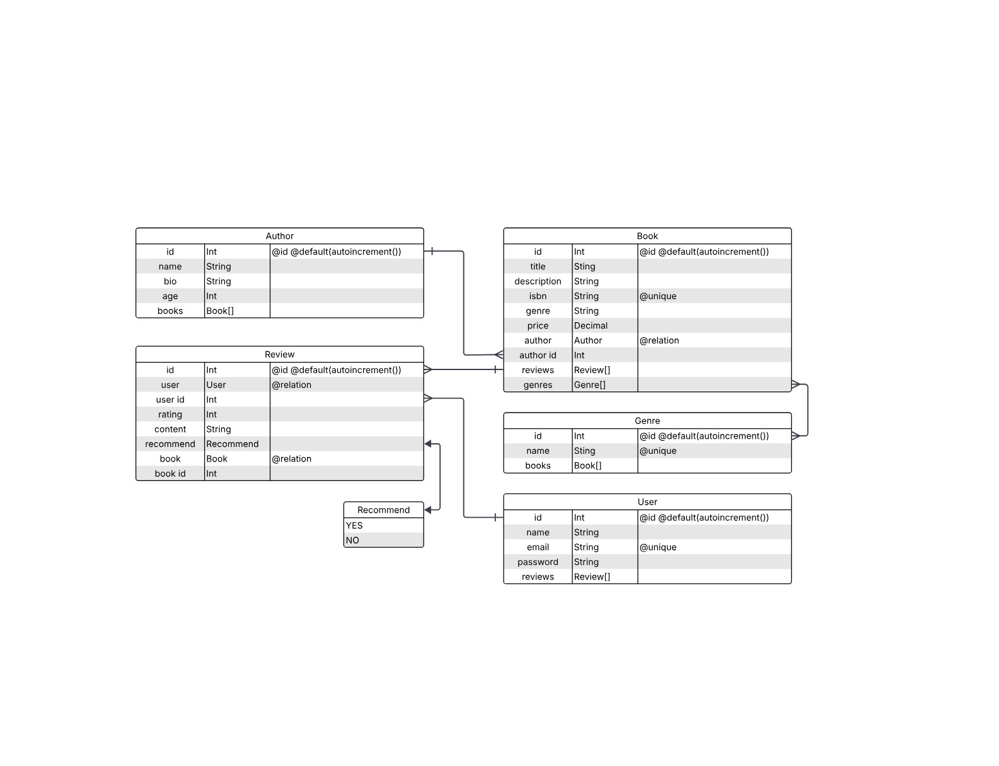

# Bryan's Book Reviews

An introductory demo project showcasing how to use **Prisma ORM** with Node.js for efficient database interaction.

---

## 🚀 What is this?

This repo provides a minimal yet complete setup for starting a Node.js project using Prisma ORM. It demonstrates:

- Defining database schema with Prisma
- Generating Prisma Client for type-safe queries
- Performing basic CRUD operations

Ideal if you're learning Prisma or building a prototype.

---

## 🛠️ Built With

- [Node.js](https://nodejs.org/) – JavaScript runtime
- [Prisma](https://www.prisma.io/) – Next‑gen ORM & database toolkit
- [SQLite](https://sqlite.org/) – Database
- [NPM](https://www.npmjs.com/) – package manager

---

## 📁 Project Structure

```
backend/                                  # Backend folder – contains server and database setup
│
├── prisma/                               # Prisma ORM configuration and database files
│   ├── migrations/                       # Auto-generated database migration history
│   ├── schema.prisma                     # Main Prisma schema defining data models and DB settings
│   ├── seed.js                           # Script to seed initial/test data into the database
│   ├── test.session.sql                  # SQL script for testing or manual DB session setup
│   └── test.sqlite                       # SQLite database file used for testing/local development
│
├── screenshoots/
│
├── package-lock.json                     # Auto-generated lockfile to ensure consistent installs
├── package.json                          # Backend dependencies, metadata, and npm scripts
└── server.js                             # Main server entry point (e.g., sets up Express app)
```

```
frontend/                                 # Frontend folder – contains UI code, assets, and styles
│
├── public/                               # Static public assets
│   └── assets/                           # Additional assets like images and PDFs
│       ├── images/
│       └── prisma_schema_book_reviews.pdf # PDF version of Prisma schema diagram
│
├── src/                                  # Source code for the frontend UI
│   ├── data/
│   │   └── emoji.js                      # Contains emoji data used in the app
│   ├── main.js                           # Main frontend JavaScript logic
│   ├── reset.css                         # CSS reset for consistent styling across browsers
│   └── style.css                         # Custom CSS styles for the app
│
├── index.html                            # Main HTML file loaded in the browser
├── package-lock.json                     # Lockfile for consistent dependency installation
└── package.json                          # Frontend project metadata and dependencies

```

```
.gitignore                                # Specifies files/folders to exclude from Git tracking
```

---

## ✅ Prerequisites

Before you begin, ensure you have:

- [Node.js](https://nodejs.org/) (v14 or above)
- [npm](https://www.npmjs.com/)
- [SQLite](https://sqlite.org/)

---

## 🧰 Getting Started

### 1. Clone the repository

```bash
git clone https://github.com/blopez024/Bryan_L_Intro_To_Prisma.git
cd Bryan_L_Intro_To_Prisma
```

### 2. Install dependencies

```bash

cd backend
npm instal
```

### 3. Configure database

Create a .env file within the prisma folder

```bash
cd prisma
echo 'DATABASE_URL="file:test.sqlite"' > filename.env
```

### 4. Generate Prisma Client

```bash
npx prisma generate
```

### 5. Run migrations

```bash
npx prisma migrate dev --name init
```

This creates the database tables based on schema.prisma.

### 6. Seed database

You can generate new data by running the following file

```bash
node seeds.js
```

### 7. Run the backend app

```bash
cd ..
node server.js
```

Server is be listening to port 5555

http://localhost:5555

Backend API:

http://localhost:5555/api/books

### 8. Run the frontend app

In a different terminal go to the frontend folder

```bash
cd frontend
```

Install dependencies & Run

```bash
npm install
npm run dev
```

### 9. Result:


---

## Prisma Model Explained



### 🧑‍💼 Author

Represents a book's author.

**Fields**: `id`, `name`, `bio`, `age`, `createdAt`, `updatedAt`  
**Relationships**:

- One **Author** can write **many Books**
- Field: `books Book[]`

---

### 📗 Book

Represents a book entry.

**Fields**: `id`, `title`, `description`, `isbn`, `price`, `createdAt`, `updatedAt`  
**Relationships**:

- Each **Book** is written by **one Author**
- Each **Book** can have **many Reviews**
- Each **Book** can belong to **multiple Genres**
- Fields: `author Author`, `reviews Review[]`, `genres Genre[]`

---

### ✍️ Review

A user review of a book.

**Fields**: `id`, `rating`, `content`, `recommend`, `date`, `createdAt`, `updatedAt`  
**Relationships**:

- Each **Review** is written by **one User**
- Each **Review** is about **one Book**
- Fields: `user User`, `book Book`

---

### 👤 User

Represents someone who writes reviews.

**Fields**: `id`, `name`, `email`, `password`, `createdAt`, `updatedAt`  
**Relationships**:

- One **User** can write **many Reviews**
- Field: `reviews Review[]`

---

### 🏷️ Genre

Represents a book genre/category.

**Fields**: `id`, `name`, `createdAt`, `updatedAt`  
**Relationships**:

- One **Genre** can include **many Books**
- One **Book** can belong to **many Genres** (many-to-many)
- Field: `books Book[]`

---

### ✅ Recommend (Enum)

Used in reviews to indicate recommendation.

Enum values:

- `YES`
- `NO`

---

## 🔗 Relationship Summary

| Model  | Related To | Relationship Type  |
| ------ | ---------- | ------------------ |
| Author | Book       | One-to-Many        |
| Book   | Author     | Many-to-One        |
| Book   | Review     | One-to-Many        |
| Book   | Genre      | Many-to-Many       |
| Review | Book, User | Many-to-One (each) |
| User   | Review     | One-to-Many        |
| Genre  | Book       | Many-to-Many       |

---
